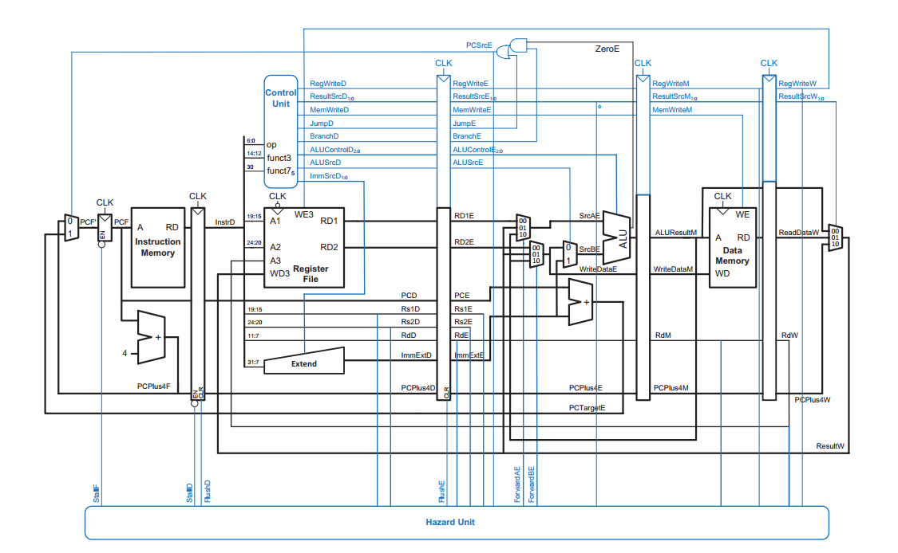
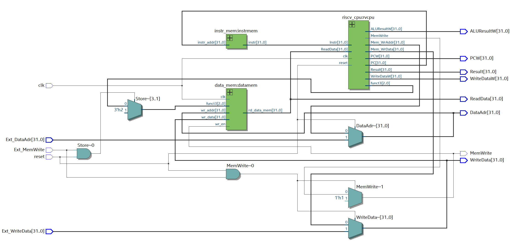
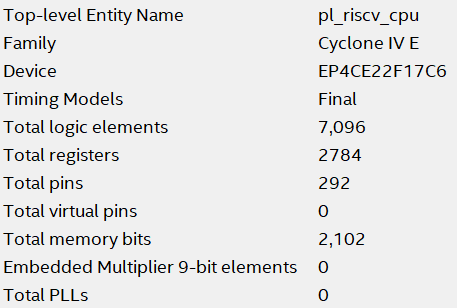
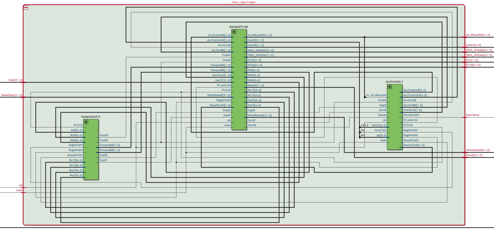
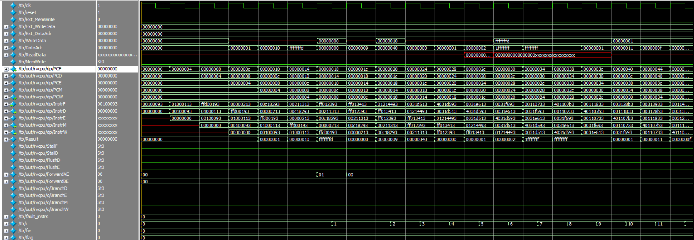
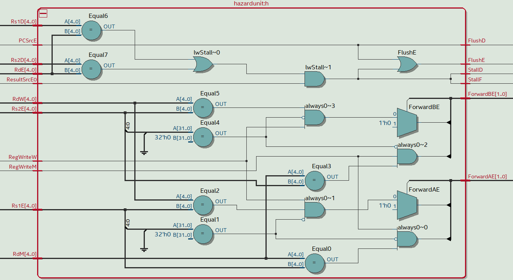
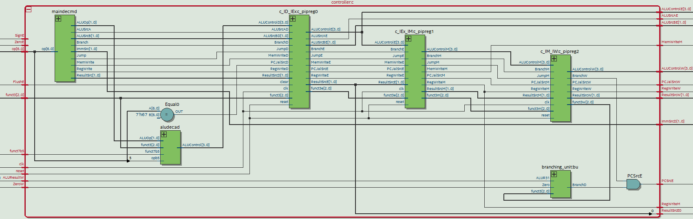

# 5-Stage Pipelined RISC-V CPU

A Verilog-based implementation of a **5-Stage Pipelined RISC-V CPU** supporting the **RV32I ISA**. This design includes pipeline stages, hazard detection, and forwarding for efficient execution, making it ideal for simulation and FPGA deployment.

---

## ✅ **Overview**

This project demonstrates a pipelined RISC-V CPU design implementing the following stages:

* **IF** - Instruction Fetch
* **ID** - Instruction Decode
* **EX** - Execute (ALU, Branch)
* **MEM** - Memory Access
* **WB** - Write Back

Key components include:

* **RISC-V CPU Core**
* **Controller & Hazard Unit**
* **Datapath with Forwarding**
* **Pipeline Registers**
* **Instruction & Data Memory**
* **Testbench for Verification**

---

## 📂 **Project Structure**

```
├── pl_risc_cpu.v         # Top-level CPU module
├── riscv_cpu.v           # CPU core with pipeline stages
├── controller.v          # Main control logic
├── hazard_unit.v         # Hazard detection and forwarding
├── datapath.v            # Pipelined datapath
├── instr_mem.v           # Instruction memory
├── data_mem.v            # Data memory
├── tb.v                  # Testbench for verification
├── components/           # ALU, muxes, regfile, pipeline regs
├── rv32i_test.hex        # Test program
├── rv32i_test.s          # Assembly source
```

---

## 🖼 **Architecture**



### **Top Module**



---

## 📸 **Stats for Nerds**

<p align="center">
  <table>
    <tr>
      <td align="center">
        
        <br/>
        <b>5 Stage Pipelined RISCV</b>
      </td>
      <td align="center">
        
        <br/>
        <b>Single Cycle RISCV</b>
      </td>
    </tr>
  </table>
</p>

---

## 📸 **Images**

### **CPU Block**



### **Waveform**



### **Hazard Unit**



### **Controller**



### **Datapath**


---

## 🧪 **Testbench**

* Simulates full pipeline operation with hazard handling.
* Verifies arithmetic, logical, load/store, branch, and jump instructions.

---

## 🛠 **How to Run**

### Simulation (ModelSim/iverilog)

```bash
iverilog -o cpu_tb tb.v pl_risc_cpu.v riscv_cpu.v data_mem.v instr_mem.v components/*.v
vvp cpu_tb
gtkwave dump.vcd
```

### FPGA Deployment (Quartus)

* Open project in Quartus
* Assign `pl_risc_cpu.v` as top module
* Compile for Cyclone IV E

---

## ✅ **Features**

* Implements **RV32I instruction set**
* 5-stage pipeline with hazard detection
* Data forwarding to minimize stalls
* Modular design, FPGA-ready

---

## 🚀 **Future Enhancements**

* Add **CSR support**
* Implement **branch prediction**
* Optimize for higher clock speed

---

### **License**

[GNU General Public License v3.0](LICENSE)
